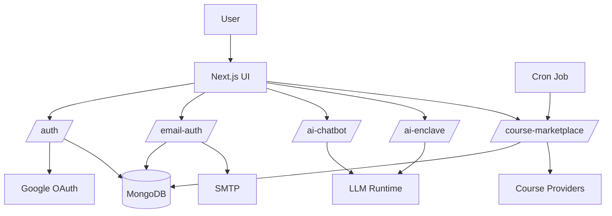

<div align="center">

<h1>
  <span style="color:#00F7FF;">Digi</span><span style="color:#FF00D4;">Tantra</span>
</h1>

[+%2B+course+marketplace+intelligence;Built+and+shipped+by+Ankan+Ghosh.)](https://git.io/typing-svg)

<br/>

[](https://digitantra.vercel.app)
[](https://github.com/ankan00V/DigiTantra)
[](https://nextjs.org/)
[](https://www.mongodb.com/)
[](https://www.typescriptlang.org/)

</div>

---

```bash
┌──[ankan@digitantra]─[~/project]
└─$ cat project_overview.txt
```

DigiTantra is a production-style, AI-powered education platform that merges:

- Data-science-focused learning tracks
- Full-stack product engineering
- LLM-driven tooling for career, learning, and content workflows

This repo includes complete web app architecture: frontend UX, backend APIs, auth/session security, MongoDB persistence, provider integrations, and Vercel deployment.

---

```bash
┌──[ankan@digitantra]─[~/project]
└─$ cat system_design.md
```

## System Design

### High-Level Design

- Frontend is built on Next.js App Router with server/client components and API routes in the same codebase.
- Authentication is hybrid:
  - Google OAuth via NextAuth.
  - Email/password + OTP with custom secure cookie sessions.
- AI layer is split by workload:
  - AI Saarthi for contextual site guidance.
  - AI Enclave for authenticated career/learning/content/dev tools.
- Persistence is fully MongoDB-backed for auth users, sessions, OTPs, OAuth user mirrors, course catalog snapshots, and API rate limits.
- Marketplace ingestion runs as scheduled refresh through Vercel Cron and is exposed through read/refresh APIs.

### Architecture Diagram



### System Design Notes

- Security boundaries:
  - Protected operations require OAuth session or `digitantra_email_session`.
  - OTP and session flows are server-side and persisted in Mongo.
  - API request throttling is persisted in `api_rate_limits`.
- Reliability:
  - AI Enclave routes return controlled JSON errors instead of raw server-component failures.
  - Course catalog reads are decoupled from refresh execution.
- Deployment:
  - Vercel hosts web + APIs.
  - Scheduled marketplace refresh runs once daily on Hobby-compatible cron.

---

```bash
┌──[ankan@digitantra]─[~/project]
└─$ cat modules.txt
```

## Core Modules

### 1) Authentication and Identity
- Google OAuth via NextAuth.
- Email signup flow: `email + name + password + OTP`.
- Email login flow: `email + password`.
- Forgot-password OTP reset flow.
- Password policy enforcement (8+, upper, lower, number, special char).
- Custom email-auth session cookie: `digitantra_email_session`.
- Mongo-backed user/session/OTP lifecycle.

### 2) AI Saarthi (site assistant)
- Endpoint: `POST /api/ai-chatbot`
- Context-constrained assistant for site guidance.
- NVIDIA-backed model runtime via `NVIDIA_*` env group.

### 3) AI Enclave
- 20 authenticated tool workspaces via `POST /api/ai-enclave/run`.
- Dedicated AI blog generator flow.
- Runtime split:
  - `AI_ENCLAVE_COMPLEX_*` for complex generation workloads.
  - `AI_ENCLAVE_CHAT_*` for lighter conversational tools.

### 4) Course Marketplace Intelligence
- Public read endpoint: `GET /api/course-marketplace`
- Protected refresh endpoint: `POST /api/course-marketplace`
- Token auth: `COURSE_MARKETPLACE_REFRESH_TOKEN` or `CRON_SECRET`
- Provider catalog ingestion, normalization, categorization, persistence.
- Daily Vercel cron refresh in [`vercel.json`](/Users/ankanghosh/Desktop/DigiTantra/vercel.json).

---

```bash
┌──[ankan@digitantra]─[~/project]
└─$ cat ai_enclave_services.txt
```

## AI Enclave Services

Career AI:
- Resume Builder
- Cover Letter Generator
- LinkedIn Optimizer
- SOP Generator
- Email Writer
- Interview Prep Coach
- Skill Gap Analyzer

Learning AI:
- Career Roadmap Generator
- Course Recommender
- Assignment Helper
- Notes Summarizer
- Quiz Generator
- Study Planner

Content AI:
- Blog Generator
- Social Caption Generator
- Ad Copy Generator
- Landing Page Copy Generator
- SEO Blog Outline Tool

Builder/Dev AI:
- Project Idea Generator
- Code Explainer
- Debug Helper

---

```bash
┌──[ankan@digitantra]─[~/project]
└─$ cat stack.txt
```

## Tech Stack

- Framework: Next.js 15 (App Router), React 18, TypeScript
- UI: Tailwind CSS, shadcn/ui, Radix UI, Recharts
- Auth: NextAuth + custom Mongo email auth
- Database: MongoDB
- AI: OpenAI SDK against NVIDIA endpoints, Genkit paths included
- Mail: Nodemailer SMTP
- Deploy: Vercel
- Local HTTPS/dev tunnel: Slim

---

```bash
┌──[ankan@digitantra]─[~/project]
└─$ cat api_surface.txt
```

## Major API Routes

- `/api/auth/[...nextauth]`
- `/api/email-auth/request-otp`
- `/api/email-auth/verify-otp`
- `/api/email-auth/login`
- `/api/email-auth/logout`
- `/api/email-auth/session`
- `/api/email-auth/profile`
- `/api/email-auth/password-reset/request-otp`
- `/api/email-auth/password-reset/verify-otp`
- `/api/ai-chatbot`
- `/api/ai-enclave/run`
- `/api/course-marketplace`

---

```bash
┌──[ankan@digitantra]─[~/project]
└─$ cat mongo_collections.txt
```

## MongoDB Collections

- `auth_email_users`
- `auth_email_otps`
- `auth_email_sessions`
- `auth_oauth_users`
- `courseMarketplace`
- `api_rate_limits`

---

```bash
┌──[ankan@digitantra]─[~/project]
└─$ cat quickstart.sh
```

## Local Setup

```bash
git clone https://github.com/ankan00V/DigiTantra.git
cd DigiTantra
npm install
npm run dev
```

App runs on:

```text
http://localhost:9002
```

Recommended local HTTPS:

```bash
slim start digitantra --port 9002
```

Then open:

```text
https://digitantra.test
```

---

## Production Notes (Vercel)

1. Configure all required env vars.
2. Use `NEXTAUTH_URL=https://digitantra.vercel.app`.
3. Google OAuth must include:
   - Authorized origin: `https://digitantra.vercel.app`
   - Redirect URI: `https://digitantra.vercel.app/api/auth/callback/google`
4. Redeploy after env updates.
5. Keep daily cron enabled for `/api/course-marketplace`.

---

## Verification Scripts

```bash
npx tsx scripts/verify-ai-enclave-services.ts
npx tsx scripts/verify-ai-enclave-production.ts https://digitantra.vercel.app <email> <password>
npx tsx scripts/verify-email-otp-e2e.ts
```

---

<div align="center">

Built by **Ankan Ghosh**  
[LinkedIn](https://www.linkedin.com/in/ankan-ghosh/) • [GitHub](https://github.com/ankan00V)

</div>
